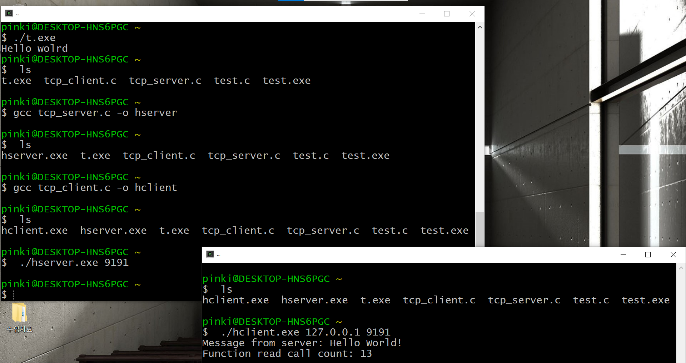

# IT-class1
## IT-class1

[네이버](https://www.naver.com/)

- 첫 번째
    - 두 번째
      - 세 번째
 
 1. **볼드체**
 2. __볼드체__
 3. *이탈릭체*
 
 >문단 모양이 된거죠.
 >
 
```
코드 블럭 안
```

* * *


</img>


## 4주차 과제
</img>


